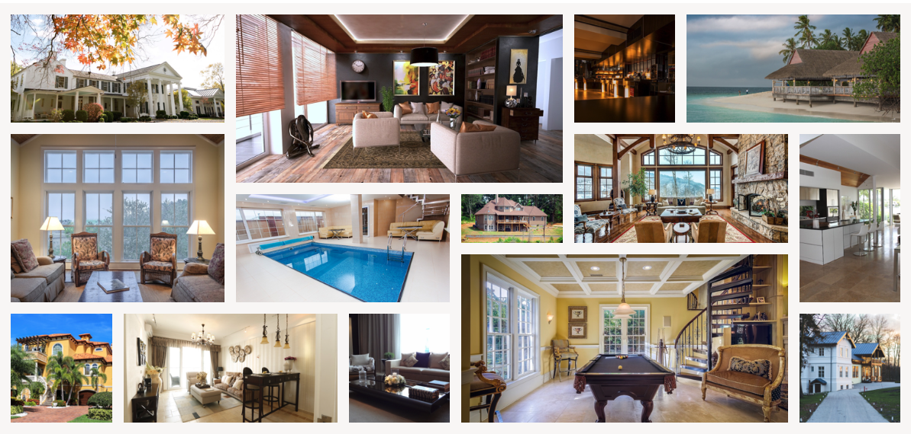
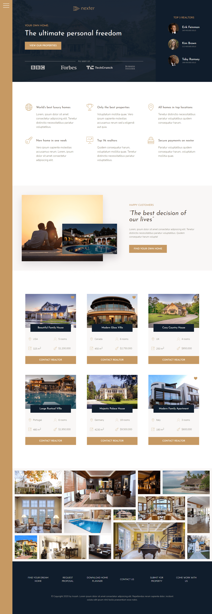
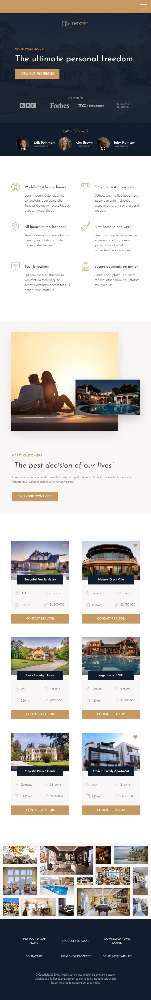

## Nexter : A Grid Project

* 3번째이자 마지막 CSS and Sass 프로젝트. 

* 메인목표는 반응형 웹페이지를 Grid layout을 이용해서 완성하는것이다.


## Instructions

프로젝트를 다운 받은뒤 아래를 실행하면 된다.

```
npm install
npm start
```


## Grid Layout

CSS Grid Layout은 가장 강력한 레이아웃 시스템이다. 2차원으로 우리가 rows와 columns 모두를 조정할 수 있다. Flex는 1차이다.

아래의 갤러리부분을 다른거 사용 없이 오직  `grid` 만을 사용하여 완성 시켰다.

```scss

  object-fit: cover;

  @include bp(500) {
    padding: 0;
  }

  &__item {
    &--1 {
      grid-row: 1/ span 2;
      grid-column: 1/3;
    }

    &--2 {
      grid-row: 1/ span 3;
      grid-column: 3/6;
    }
    
    ...
}
```




## Responsive Design

이 프로젝트는 데스크탑 크기를 기준으로 먼저 작성을 하였다. 그 이후에는 `@media` 미디어 쿼리를 사용하여 점점 작은 화면들을 기준으로 적용시켰다. 

`grid-templates-rows` 와 `grid-template-columns` 에 변화를 주어 반응형 웹을 완성시켰다.

```scss

.container {
  display: grid;
  grid-template-rows: 80vh min-content 40vw repeat(3, min-content);
  grid-template-columns: [sidebar-start] 8rem [sidebar-end full-start] minmax(6rem, 1fr) [center-start] repeat(8, [col-start] minmax(min-content, 14rem) [col-end]) [center-end] minmax(6rem, 1fr) [full-end];
  // 최소 min-content사이즈 최대 14rem;
  // grid-template-columns: [sidebar-start] 8rem [sidebar-end full-start] minmax(6rem, 1fr) [center-start] repeat(8, [col-start] minmax(min-content, 14rem) [col-end]) [center-end] minmax(6rem, 1fr) [full-end];

  @include bp(1000) {
    grid-template-rows: 6rem 80vh min-content 40vw repeat(3, min-content);
    grid-template-columns: [full-start] minmax(6rem, 1fr) [center-start] repeat(8, [col-start] minmax(min-content, 14rem) [col-end]) [center-end] minmax(6rem, 1fr) [full-end];
  }

  @include bp(800) {
    grid-template-rows: 6rem calc(100vh - 6rem);
  }

}
```


|                       Desktop Screens                        |                   Tablet & Mobile Screens                    |
| :----------------------------------------------------------: | :----------------------------------------------------------: |
| [](https://github.com/Irozaih/nexter/blob/master/img/readme/desktop-screens.png) | ](https://github.com/Irozaih/nexter/blob/master/img/readme/tablet-mobile-screens.png) |

## 
